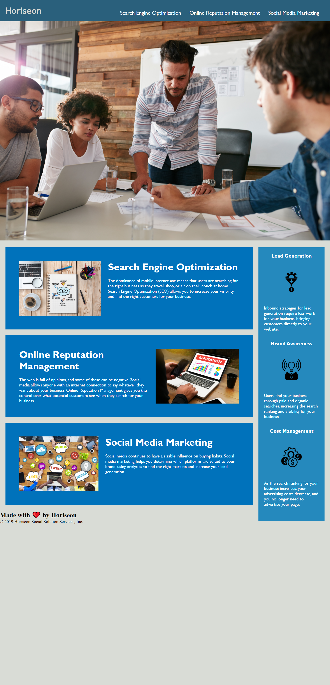

# Horiseon

## Description
For this repository, we will update the client's webpage to meet accessibility standards by updating the HTML elements and it's relative css stylesheet.

## Instructions
1. Webpage must meet accessibility standards.
2. HTML contains semantic elements.
3. HTML elements follow a logical structure independent of styling and positioning.
4. All image elements should have accessible alt attributes.
5. Heading attributes should fall in sequential order.
6. Title element should have a concise, descriptive title.

## Project Details
* The website title was updated.
* Updated the HTML contents to include semantic elements.
* Structured the HTML and CSS to follow a more readible format.
* Added alt attributes to all images.

## Technology
* HTML5
* CSS3 

## Website Access
* Github Repository
    * https://github.com/maiyiax/Horiseon

* Deployed URL
    * https://horiseon.vercel.app/